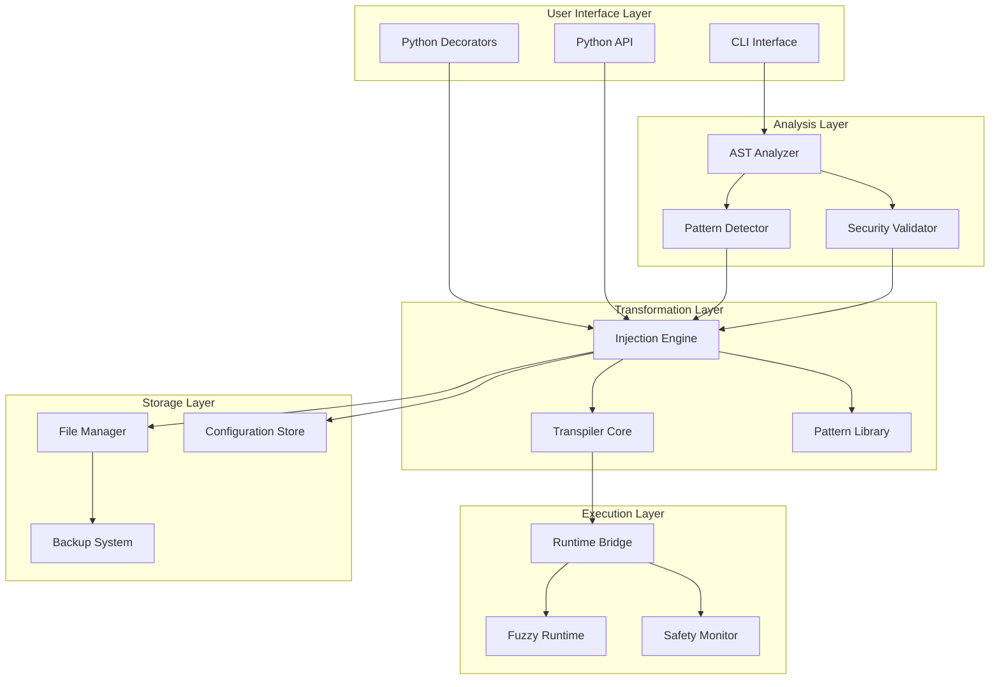
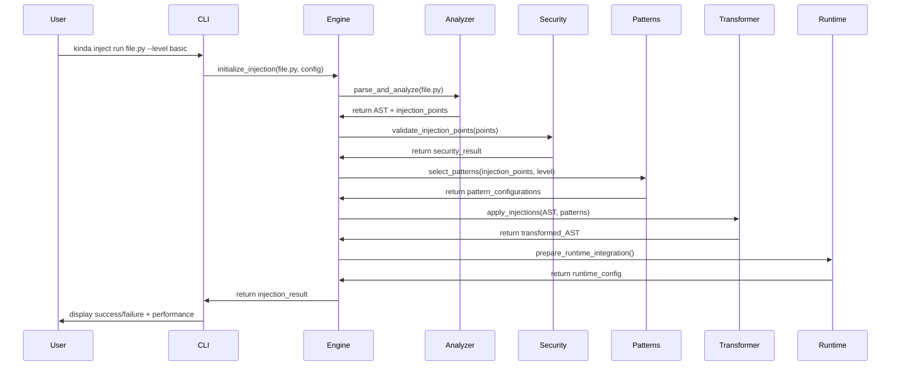
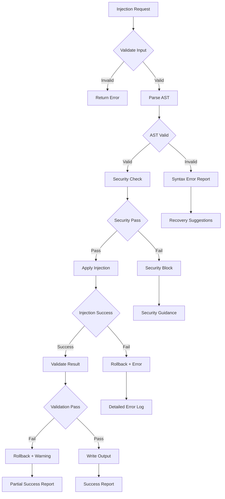
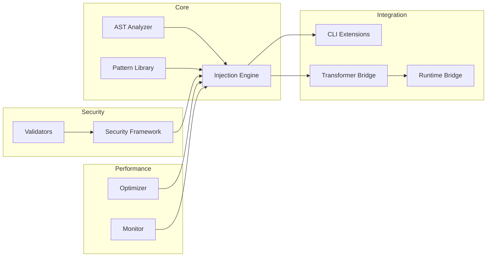

# Python Injection Framework - Technical Architecture

## 📋 Document Overview
**Epic**: #127 Python Injection Framework
**Target Release**: v0.5.5 "Python Enhancement Bridge"
**Architecture Date**: 2025-09-15
**Status**: Design Phase

This document defines the technical architecture for the Python Injection Framework, enabling seamless integration of kinda-lang probabilistic constructs into existing Python codebases.

## 🎯 Architecture Goals

### Primary Objectives
1. **Seamless Integration**: Inject kinda-lang constructs into Python code without breaking existing functionality
2. **Gradual Migration**: Enable incremental adoption of probabilistic programming patterns
3. **Performance**: <10% overhead for injected constructs, native performance for unchanged code
4. **Security**: Comprehensive protection against code injection vulnerabilities
5. **Extensibility**: Foundation for v0.6.0 multi-language support (C/MATLAB)

### Strategic Alignment
- **v0.5.0 Foundation**: Builds on complete probabilistic programming paradigm
- **v0.5.5 Bridge**: Enables dual "enhancement + complete language" positioning
- **v0.6.0 Preparation**: Establishes transpiler infrastructure patterns

## 🏗️ System Architecture

### High-Level Component Overview



## 🔧 Core Components

### 1. Python AST Analyzer (`kinda.injection.ast_analyzer`)

**Purpose**: Parse and analyze Python code for injection opportunities

**Key Classes**:
```python
class PythonASTAnalyzer:
    """
    Main entry point for Python code analysis
    """
    def parse_file(self, file_path: Path) -> ast.AST
    def find_injection_points(self, tree: ast.AST) -> List[InjectionPoint]
    def validate_syntax(self, tree: ast.AST) -> ValidationResult
    def extract_functions(self, tree: ast.AST) -> List[FunctionInfo]

class InjectionPoint:
    """
    Represents a location where kinda constructs can be injected
    """
    location: CodeLocation
    injection_type: InjectionType
    context: InjectionContext
    safety_level: SecurityLevel

class FunctionInfo:
    """
    Metadata about Python functions for injection planning
    """
    name: str
    args: List[str]
    body_nodes: List[ast.stmt]
    complexity_score: int
    injection_candidates: List[InjectionPoint]
```

**Integration Points**:
- Extends existing `kinda.langs.python.transformer` patterns
- Leverages Python built-in `ast` module for robustness
- Integrates with `kinda.security` for validation

### 2. Injection Engine (`kinda.injection.engine`)

**Purpose**: Core transformation engine for probabilistic construct injection

**Key Classes**:
```python
class InjectionEngine:
    """
    Main injection orchestration engine
    """
    def __init__(self, analyzer: PythonASTAnalyzer,
                 security: SecurityValidator,
                 patterns: PatternLibrary)

    def inject_decorators(self, tree: ast.AST,
                         config: InjectionConfig) -> TransformResult
    def inject_inline(self, tree: ast.AST,
                     targets: List[InjectionPoint]) -> TransformResult
    def validate_injection(self, result: TransformResult) -> bool

class InjectionConfig:
    """
    Configuration for injection behavior
    """
    level: InjectionLevel  # BASIC, INTERMEDIATE, ADVANCED
    patterns: List[PatternType]
    safety_mode: SafetyMode
    backup_strategy: BackupStrategy
    performance_target: PerformanceTarget

class TransformResult:
    """
    Result of injection transformation
    """
    transformed_ast: ast.AST
    injection_summary: InjectionSummary
    warnings: List[InjectionWarning]
    performance_impact: PerformanceImpact
```

**Injection Strategies**:
1. **Decorator-Based Injection**: `@inject.probabilistic` decorators
2. **Inline Pattern Injection**: Direct code pattern replacement
3. **Function-Level Conversion**: Complete function transformation
4. **Block-Level Enhancement**: Selective code block enhancement

### 3. Pattern Library (`kinda.injection.patterns`)

**Purpose**: Reusable injection patterns for common use cases

**Pattern Categories**:

#### Primitive Injection Patterns
```python
class PrimitivePatterns:
    """
    Basic variable and assignment injection patterns
    """
    @staticmethod
    def kinda_variable_assignment(var_name: str, value: Any) -> str:
        return f"{var_name} = kinda_int({value})"

    @staticmethod
    def fuzzy_reassignment(var_name: str, expression: str) -> str:
        return f"{var_name} = fuzzy_assign('{var_name}', {expression})"

    @staticmethod
    def probabilistic_print(expression: str) -> str:
        return f"sorta_print({expression})"
```

#### Control Flow Injection Patterns
```python
class ControlFlowPatterns:
    """
    Conditional and loop injection patterns
    """
    @staticmethod
    def sometimes_conditional(condition: str, body: str) -> str:
        return f"if sometimes({condition}):\n{indent(body)}"

    @staticmethod
    def maybe_loop_iteration(iterator: str, collection: str, body: str) -> str:
        return f"for {iterator} in {collection}:\n{indent(f'if maybe_for_item_execute():\n{indent(body)}')}"

    @staticmethod
    def probabilistic_while(condition: str, body: str) -> str:
        return f"while sometimes_while_condition({condition}):\n{indent(body)}"
```

#### Advanced Pattern Specifications
```python
class AdvancedPatterns:
    """
    Complex injection patterns with fallbacks and statistics
    """
    @staticmethod
    def welp_fallback_pattern(primary: str, fallback: str) -> str:
        return f"welp_fallback(lambda: {primary}, {fallback})"

    @staticmethod
    def statistical_assertion(condition: str, probability: float) -> str:
        return f"assert_probability(lambda: {condition}, expected_prob={probability})"

    @staticmethod
    def drift_tracking_variable(var_name: str, initial_value: str) -> str:
        return f"{var_name} = time_drift_int('{var_name}', {initial_value})"
```

### 4. Security Framework Extension (`kinda.injection.security`)

**Purpose**: Enhanced security validation for code injection scenarios

**Key Extensions**:
```python
class InjectionSecurityValidator:
    """
    Security validation specific to code injection
    """
    def __init__(self, base_security: SecurityValidator):
        self.base_security = base_security

    def validate_decorator_usage(self, decorator: ast.FunctionDef) -> SecurityResult
    def check_injection_boundaries(self, injection_points: List[InjectionPoint]) -> SecurityResult
    def validate_ast_modifications(self, original: ast.AST, modified: ast.AST) -> SecurityResult
    def authorize_injection_scope(self, scope: InjectionScope) -> bool

class InjectionScope:
    """
    Defines the authorized scope for injection operations
    """
    allowed_functions: List[str]
    allowed_modules: List[str]
    prohibited_patterns: List[str]
    safety_level: SecurityLevel
```

**Security Enhancements**:
1. **AST Validation**: Comprehensive AST integrity checking before/after injection
2. **Decorator Authorization**: Whitelist-based decorator usage validation
3. **Scope Limitation**: Restrict injection to authorized code sections
4. **Runtime Boundaries**: Enforce execution boundaries for injected code

### 5. Performance Optimization Engine (`kinda.injection.performance`)

**Purpose**: Ensure minimal performance impact from injection framework

**Optimization Strategies**:

#### Lazy Loading and Caching
```python
class PerformanceOptimizer:
    """
    Performance optimization coordination
    """
    def __init__(self):
        self.ast_cache = LRUCache(maxsize=100)
        self.pattern_cache = PatternCache()
        self.injection_cache = InjectionCache()

    def optimize_ast_parsing(self, file_path: Path) -> ast.AST
    def cache_injection_patterns(self, patterns: List[Pattern]) -> None
    def optimize_runtime_injection(self, injection_points: List[InjectionPoint]) -> None

class LazyASTLoader:
    """
    Lazy loading for AST parsing and analysis
    """
    def load_file(self, path: Path) -> ast.AST  # Parse only when needed
    def invalidate_cache(self, path: Path) -> None  # Handle file modifications
```

#### Memory Management
```python
class MemoryManager:
    """
    Memory optimization for large codebase processing
    """
    def manage_ast_lifecycle(self, trees: List[ast.AST]) -> None
    def optimize_pattern_storage(self, patterns: PatternLibrary) -> None
    def cleanup_injection_cache(self) -> None
```

## 🔌 Integration Architecture

### Integration with Existing Transformer Infrastructure

**Current Infrastructure Leverage**:
```python
# Existing: kinda/langs/python/transformer.py
class KindaTransformer:
    def transform_line(self, line: str) -> List[str]
    def transform_file(self, path: Path) -> str

# New: Integration Bridge
class InjectionTransformerBridge:
    """
    Bridge between injection engine and existing transformer
    """
    def __init__(self, transformer: KindaTransformer,
                 injection_engine: InjectionEngine):
        self.transformer = transformer
        self.injection_engine = injection_engine

    def transform_with_injection(self, file_path: Path,
                               injection_config: InjectionConfig) -> str:
        # 1. Parse with AST analyzer
        ast_tree = self.injection_engine.analyze(file_path)

        # 2. Apply injections
        injection_result = self.injection_engine.inject(ast_tree, injection_config)

        # 3. Convert back to source
        modified_source = ast.unparse(injection_result.transformed_ast)

        # 4. Apply existing transformer for kinda constructs
        return self.transformer.transform_file_content(modified_source)
```

### CLI Integration Points

**Command Extensions**:
```python
# Extension to existing kinda/cli.py
def add_injection_commands(parser: argparse.ArgumentParser):
    """
    Add injection-specific commands to existing CLI
    """
    inject_parser = parser.add_subparser('inject', help='Python injection commands')

    # Basic injection command
    inject_run = inject_parser.add_subparser('run', help='Inject and run Python file')
    inject_run.add_argument('file', help='Python file to inject')
    inject_run.add_argument('--level', choices=['basic', 'intermediate', 'advanced'])
    inject_run.add_argument('--inplace', action='store_true', help='Modify file in place')
    inject_run.add_argument('--backup', action='store_true', help='Create backup before modification')

    # Analysis command
    inject_analyze = inject_parser.add_subparser('analyze', help='Analyze Python file for injection opportunities')
    inject_analyze.add_argument('file', help='Python file to analyze')
    inject_analyze.add_argument('--patterns', help='Focus on specific patterns')
    inject_analyze.add_argument('--report', help='Generate detailed report')

    # Conversion command
    inject_convert = inject_parser.add_subparser('convert', help='Convert Python file to kinda-enhanced version')
    inject_convert.add_argument('file', help='Python file to convert')
    inject_convert.add_argument('--gradual', action='store_true', help='Gradual conversion mode')
    inject_convert.add_argument('--functions', nargs='+', help='Specific functions to convert')
```

### Security Framework Integration

**Enhanced Security Pipeline**:
```python
class IntegratedSecurityPipeline:
    """
    Integration of injection security with existing kinda security
    """
    def __init__(self,
                 base_security: SecurityValidator,
                 injection_security: InjectionSecurityValidator):
        self.base_security = base_security
        self.injection_security = injection_security

    def validate_full_pipeline(self,
                              original_code: str,
                              injection_config: InjectionConfig,
                              injected_code: str) -> SecurityResult:
        # 1. Validate injection configuration
        config_result = self.injection_security.validate_injection_config(injection_config)
        if not config_result.is_safe:
            return config_result

        # 2. Validate injected code with existing security
        code_result = self.base_security.secure_condition_check(injected_code, "injection")
        if not code_result[0]:  # Not safe to proceed
            return SecurityResult(False, "Base security validation failed")

        # 3. Validate injection-specific security
        injection_result = self.injection_security.validate_ast_modifications(
            ast.parse(original_code),
            ast.parse(injected_code)
        )

        return injection_result
```

## 📊 Performance Architecture

### Performance Targets and Monitoring

**Key Performance Indicators**:
1. **Injection Overhead**: <10% performance penalty for probabilistic constructs
2. **CLI Responsiveness**: <100ms for basic injection commands
3. **Memory Usage**: <50MB additional memory for large codebases
4. **Parsing Speed**: >1000 lines/second for AST analysis

**Performance Monitoring Framework**:
```python
class PerformanceMonitor:
    """
    Real-time performance monitoring for injection operations
    """
    def __init__(self):
        self.metrics = PerformanceMetrics()
        self.thresholds = PerformanceThresholds()

    def monitor_injection_operation(self, operation: InjectionOperation) -> PerformanceReport:
        with self.metrics.time_operation(operation.name):
            result = operation.execute()

        memory_usage = self.metrics.get_memory_usage()
        execution_time = self.metrics.get_execution_time(operation.name)

        return PerformanceReport(
            operation=operation.name,
            execution_time=execution_time,
            memory_usage=memory_usage,
            within_thresholds=self.check_thresholds(execution_time, memory_usage)
        )

class PerformanceOptimizationEngine:
    """
    Automatic performance optimization based on usage patterns
    """
    def optimize_ast_caching(self, usage_patterns: UsagePatterns) -> None
    def adjust_pattern_loading(self, frequency_data: FrequencyData) -> None
    def optimize_memory_allocation(self, memory_profile: MemoryProfile) -> None
```

### Scalability Architecture

**Large Codebase Support**:
```python
class ScalabilityEngine:
    """
    Handle injection for large codebases efficiently
    """
    def __init__(self):
        self.parallel_processor = ParallelProcessor()
        self.incremental_analyzer = IncrementalAnalyzer()
        self.dependency_tracker = DependencyTracker()

    def process_large_codebase(self,
                              codebase_path: Path,
                              injection_config: InjectionConfig) -> BatchResult:
        # 1. Discover all Python files
        python_files = self.discover_python_files(codebase_path)

        # 2. Analyze dependencies
        dependency_graph = self.dependency_tracker.build_graph(python_files)

        # 3. Process in dependency order with parallelization
        processing_order = dependency_graph.topological_sort()

        # 4. Parallel processing where safe
        batch_results = self.parallel_processor.process_batch(
            processing_order,
            injection_config
        )

        return BatchResult(
            files_processed=len(python_files),
            successful_injections=batch_results.successes,
            failed_injections=batch_results.failures,
            performance_summary=batch_results.performance
        )
```

## 🔄 Data Flow Architecture

### Injection Pipeline Flow



### Error Handling and Recovery Flow



## 🏛️ Extensibility Architecture

### Foundation for v0.6.0 Multi-Language Support

**Abstract Base Classes**:
```python
class LanguageTranspiler(ABC):
    """
    Abstract base for language-specific transpilers
    """
    @abstractmethod
    def parse_source(self, source: str) -> LanguageAST

    @abstractmethod
    def inject_constructs(self, ast: LanguageAST,
                         patterns: List[Pattern]) -> TransformResult

    @abstractmethod
    def generate_target_code(self, ast: LanguageAST) -> str

class PythonTranspiler(LanguageTranspiler):
    """
    Python-specific implementation
    """
    def parse_source(self, source: str) -> ast.AST
    def inject_constructs(self, ast: ast.AST, patterns: List[Pattern]) -> TransformResult
    def generate_target_code(self, ast: ast.AST) -> str

# Future implementations:
class CTranspiler(LanguageTranspiler):
    """
    C language transpiler (v0.6.0)
    """
    pass

class MATLABTranspiler(LanguageTranspiler):
    """
    MATLAB/Octave transpiler (v0.6.0)
    """
    pass
```

**Plugin Architecture for Advanced Features**:
```python
class InjectionPlugin(ABC):
    """
    Plugin interface for extending injection capabilities
    """
    @abstractmethod
    def get_plugin_name(self) -> str

    @abstractmethod
    def get_supported_patterns(self) -> List[PatternType]

    @abstractmethod
    def apply_plugin_injection(self,
                              ast: LanguageAST,
                              context: InjectionContext) -> PluginResult

class PluginManager:
    """
    Manage and coordinate injection plugins
    """
    def register_plugin(self, plugin: InjectionPlugin) -> None
    def discover_plugins(self) -> List[InjectionPlugin]
    def apply_plugins(self, injection_request: InjectionRequest) -> PluginResults
```

## 📈 Monitoring and Observability

### Injection Analytics Framework

```python
class InjectionAnalytics:
    """
    Analytics and monitoring for injection operations
    """
    def __init__(self):
        self.metrics_collector = MetricsCollector()
        self.usage_tracker = UsageTracker()
        self.performance_analyzer = PerformanceAnalyzer()

    def track_injection_event(self, event: InjectionEvent) -> None:
        self.metrics_collector.record_event(event)
        self.usage_tracker.update_patterns(event.patterns_used)
        self.performance_analyzer.record_timing(event.execution_time)

    def generate_analytics_report(self, timeframe: TimeFrame) -> AnalyticsReport:
        return AnalyticsReport(
            injection_frequency=self.metrics_collector.get_frequency(timeframe),
            popular_patterns=self.usage_tracker.get_top_patterns(timeframe),
            performance_trends=self.performance_analyzer.get_trends(timeframe),
            error_analysis=self.metrics_collector.get_error_patterns(timeframe)
        )
```

### Health Monitoring

```python
class InjectionHealthMonitor:
    """
    Monitor injection framework health and performance
    """
    def check_framework_health(self) -> HealthStatus:
        return HealthStatus(
            ast_parser_status=self.check_ast_parser(),
            security_validator_status=self.check_security(),
            pattern_library_status=self.check_patterns(),
            performance_status=self.check_performance()
        )

    def get_health_dashboard(self) -> HealthDashboard:
        return HealthDashboard(
            current_health=self.check_framework_health(),
            recent_issues=self.get_recent_issues(),
            performance_metrics=self.get_current_metrics(),
            system_resources=self.get_resource_usage()
        )
```

## 🔒 Security Architecture Deep Dive

### Comprehensive Security Model

**Multi-Layer Security Approach**:
1. **Input Validation Layer**: Validate all user inputs and configurations
2. **AST Security Layer**: Ensure AST integrity and prevent malicious modifications
3. **Injection Boundary Layer**: Control and monitor injection scope and permissions
4. **Runtime Security Layer**: Monitor execution and prevent security violations
5. **Output Validation Layer**: Validate generated code before execution

**Security Implementation**:
```python
class ComprehensiveSecurityFramework:
    """
    Multi-layer security framework for injection operations
    """
    def __init__(self):
        self.input_validator = InputValidator()
        self.ast_security = ASTSecurityValidator()
        self.boundary_controller = InjectionBoundaryController()
        self.runtime_monitor = RuntimeSecurityMonitor()
        self.output_validator = OutputValidator()

    def secure_injection_pipeline(self,
                                 injection_request: InjectionRequest) -> SecureResult:
        # Layer 1: Input Validation
        input_result = self.input_validator.validate(injection_request)
        if not input_result.is_secure:
            return SecureResult.fail("Input validation failed", input_result.issues)

        # Layer 2: AST Security
        ast_result = self.ast_security.validate_ast_operation(injection_request)
        if not ast_result.is_secure:
            return SecureResult.fail("AST security check failed", ast_result.issues)

        # Layer 3: Boundary Control
        boundary_result = self.boundary_controller.authorize_injection(injection_request)
        if not boundary_result.is_authorized:
            return SecureResult.fail("Injection not authorized", boundary_result.restrictions)

        # Perform injection with monitoring
        with self.runtime_monitor.monitor_injection():
            injection_result = self.perform_secure_injection(injection_request)

        # Layer 4: Output Validation
        output_result = self.output_validator.validate_output(injection_result)
        if not output_result.is_secure:
            return SecureResult.fail("Output validation failed", output_result.issues)

        return SecureResult.success(injection_result)
```

## 📚 Testing Architecture

### Comprehensive Testing Framework

**Testing Pyramid for Injection Framework**:
```python
class InjectionTestFramework:
    """
    Comprehensive testing framework for injection operations
    """
    def __init__(self):
        self.unit_tester = UnitTestRunner()
        self.integration_tester = IntegrationTestRunner()
        self.security_tester = SecurityTestRunner()
        self.performance_tester = PerformanceTestRunner()
        self.compatibility_tester = CompatibilityTestRunner()

    def run_full_test_suite(self) -> TestResults:
        results = TestResults()

        # Unit tests: Individual component testing
        results.unit_results = self.unit_tester.run_tests([
            AST_ANALYZER_TESTS,
            INJECTION_ENGINE_TESTS,
            PATTERN_LIBRARY_TESTS,
            SECURITY_FRAMEWORK_TESTS
        ])

        # Integration tests: Component interaction testing
        results.integration_results = self.integration_tester.run_tests([
            CLI_INTEGRATION_TESTS,
            TRANSFORMER_INTEGRATION_TESTS,
            RUNTIME_INTEGRATION_TESTS
        ])

        # Security tests: Security vulnerability testing
        results.security_results = self.security_tester.run_tests([
            INJECTION_ATTACK_TESTS,
            PRIVILEGE_ESCALATION_TESTS,
            DATA_VALIDATION_TESTS
        ])

        # Performance tests: Ensure performance targets
        results.performance_results = self.performance_tester.run_tests([
            INJECTION_OVERHEAD_TESTS,
            MEMORY_USAGE_TESTS,
            SCALABILITY_TESTS
        ])

        # Compatibility tests: Major Python library integration
        results.compatibility_results = self.compatibility_tester.run_tests([
            NUMPY_COMPATIBILITY_TESTS,
            PANDAS_COMPATIBILITY_TESTS,
            FLASK_COMPATIBILITY_TESTS
        ])

        return results
```

## 🚀 Deployment and Operations

### Production Deployment Considerations

**Deployment Architecture**:
```python
class InjectionFrameworkDeployment:
    """
    Production deployment configuration and management
    """
    def __init__(self):
        self.config_manager = ConfigurationManager()
        self.health_checker = HealthChecker()
        self.monitoring_setup = MonitoringSetup()

    def deploy_framework(self, environment: Environment) -> DeploymentResult:
        # Configure for environment
        config = self.config_manager.get_environment_config(environment)

        # Setup monitoring and logging
        self.monitoring_setup.configure_monitoring(config.monitoring)

        # Validate deployment health
        health_status = self.health_checker.check_deployment_health()

        if health_status.is_healthy:
            return DeploymentResult.success(config, health_status)
        else:
            return DeploymentResult.failure(health_status.issues)

    def configure_production_security(self) -> SecurityConfiguration:
        return SecurityConfiguration(
            security_level=SecurityLevel.PRODUCTION,
            audit_logging=True,
            restricted_patterns=PRODUCTION_RESTRICTED_PATTERNS,
            performance_monitoring=True,
            error_reporting=True
        )
```

---

## 📋 Architecture Summary

### Key Architectural Principles

1. **Modularity**: Clear separation of concerns with well-defined interfaces
2. **Extensibility**: Plugin-based architecture supporting future language expansion
3. **Security-First**: Multi-layer security with comprehensive validation
4. **Performance-Aware**: Optimization strategies built into core architecture
5. **Integration-Friendly**: Seamless integration with existing kinda-lang infrastructure

### Component Dependencies



### Success Metrics

- **Performance**: <10% overhead for injected constructs
- **Security**: Zero successful security bypasses in testing
- **Usability**: >90% user task completion rate for injection operations
- **Compatibility**: >95% compatibility with top Python libraries
- **Reliability**: <1% injection operation failure rate

---

**Document Version**: 1.0
**Last Updated**: 2025-09-15
**Next Review**: Implementation Phase Start
**Architecture Approval**: Epic #127 Team Review Required

This architecture serves as the foundation for implementing the Python Injection Framework, enabling seamless integration of kinda-lang probabilistic constructs into existing Python codebases while maintaining security, performance, and extensibility requirements.