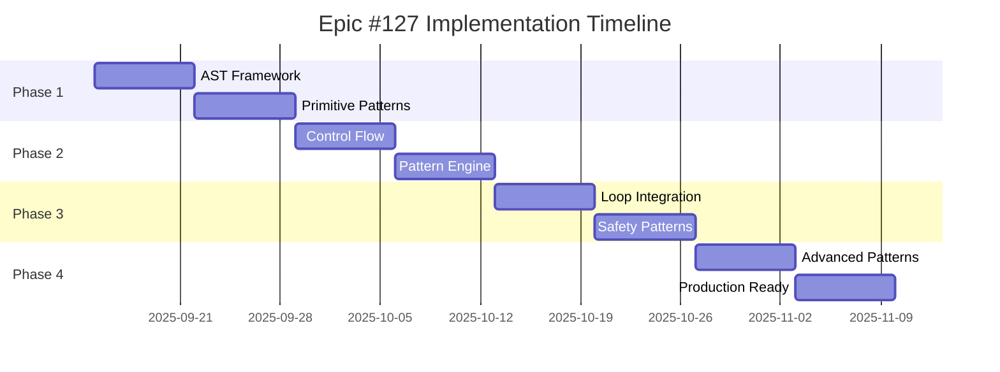

# Python Injection Framework - 4-Phase Implementation Design

## 📋 Document Overview
**Epic**: #127 Python Injection Framework
**Target Release**: v0.5.5 "Python Enhancement Bridge"
**Implementation Design Date**: 2025-09-15
**Status**: Design Phase

This document defines the detailed 4-phase implementation plan for the Python Injection Framework, breaking down the 8-week development cycle into manageable phases with clear deliverables and dependencies.

## 🎯 Implementation Strategy

### Overall Timeline
- **Total Duration**: 8 weeks
- **Phase Duration**: 2 weeks each
- **Development Approach**: Iterative with continuous integration
- **Risk Mitigation**: MVP approach with incremental complexity

### Success Criteria
- **Performance**: <10% overhead for injected constructs
- **Security**: Zero security vulnerabilities in penetration testing
- **Usability**: >90% user task completion rate
- **Compatibility**: >95% compatibility with top Python libraries
- **Reliability**: <1% injection operation failure rate

## 🚀 Phase 1: Python AST Framework & Primitives (Weeks 1-2)

### Phase 1 Objectives
1. Build robust Python AST analysis foundation
2. Implement primitive injection patterns (kinda_int, kinda_float, sorta_print)
3. Establish security validation framework
4. Create basic CLI interface for injection

### Phase 1 Deliverables

#### 1.1 AST Analysis Engine (`kinda.injection.ast_analyzer`)

**Key Components**:
```python
# kinda/injection/__init__.py
from .ast_analyzer import PythonASTAnalyzer
from .injection_engine import InjectionEngine
from .patterns import PatternLibrary
from .security import InjectionSecurityValidator

# kinda/injection/ast_analyzer.py
class PythonASTAnalyzer:
    """Core AST analysis for Python injection"""

    def __init__(self):
        self.parser = ASTParser()
        self.visitor = InjectionVisitor()

    def parse_file(self, file_path: Path) -> ast.AST:
        """Parse Python file into AST"""

    def find_injection_points(self, tree: ast.AST) -> List[InjectionPoint]:
        """Identify opportunities for injection"""

    def validate_syntax(self, tree: ast.AST) -> ValidationResult:
        """Validate AST for injection compatibility"""

class InjectionPoint:
    """Represents an injection opportunity"""
    def __init__(self,
                 location: CodeLocation,
                 pattern_type: PatternType,
                 safety_level: SecurityLevel,
                 confidence: float):
        self.location = location
        self.pattern_type = pattern_type
        self.safety_level = safety_level
        self.confidence = confidence
```

**Implementation Tasks**:
- [ ] AST parsing with error handling and encoding support
- [ ] Injection point detection using ast.NodeVisitor
- [ ] Code location tracking with line/column information
- [ ] Integration with existing kinda security framework
- [ ] Unit tests with comprehensive AST scenario coverage

#### 1.2 Primitive Injection Patterns

**Pattern Implementations**:
```python
# kinda/injection/patterns/primitives.py
class KindaIntPattern(InjectionPattern):
    """Inject kinda_int behavior into integer assignments"""

    def detect(self, node: ast.AST) -> bool:
        """Detect integer assignment patterns"""

    def transform(self, node: ast.Assign) -> ast.AST:
        """Transform assignment to use kinda_int"""

    def validate_safety(self, node: ast.AST) -> SafetyResult:
        """Ensure safe to apply kinda_int"""

class KindaFloatPattern(InjectionPattern):
    """Inject kinda_float behavior into float assignments"""
    # Similar structure for float patterns

class SortaPrintPattern(InjectionPattern):
    """Convert print statements to probabilistic output"""
    # Pattern for print statement transformation
```

**Implementation Tasks**:
- [ ] Kinda integer pattern detection and transformation
- [ ] Kinda float pattern with variance configuration
- [ ] Sorta print pattern for probabilistic output
- [ ] Pattern safety validation with security checks
- [ ] Integration with existing runtime helpers

#### 1.3 Security Validation Framework

**Security Extensions**:
```python
# kinda/injection/security.py
class InjectionSecurityValidator:
    """Enhanced security for injection operations"""

    def __init__(self, base_security: SecurityValidator):
        self.base_security = base_security

    def validate_injection_request(self, request: InjectionRequest) -> SecurityResult:
        """Validate entire injection request"""

    def validate_ast_modification(self, original: ast.AST, modified: ast.AST) -> SecurityResult:
        """Ensure AST modifications are safe"""

    def authorize_pattern_usage(self, pattern: InjectionPattern, context: InjectionContext) -> bool:
        """Authorize specific pattern usage"""

class InjectionAuditLogger:
    """Audit logging for injection operations"""
    def log_injection_attempt(self, request: InjectionRequest, result: InjectionResult):
        """Log injection operations for security analysis"""
```

**Implementation Tasks**:
- [ ] Integration with existing kinda.security module
- [ ] AST integrity validation before/after injection
- [ ] Pattern-specific security validation
- [ ] Audit logging for security monitoring
- [ ] Security penetration testing framework

#### 1.4 Basic CLI Interface

**CLI Command Implementation**:
```bash
# Basic CLI commands for Phase 1
kinda inject run <file> --level basic
kinda inject analyze <file>
kinda inject validate <file>
```

**CLI Implementation**:
```python
# Extension to kinda/cli.py
def add_injection_commands(parser: argparse.ArgumentParser):
    """Add Phase 1 injection commands"""
    inject_parser = parser.add_subparser('inject')

    # inject run command
    run_parser = inject_parser.add_subparser('run')
    run_parser.add_argument('file')
    run_parser.add_argument('--level', choices=['basic'], default='basic')

    # inject analyze command
    analyze_parser = inject_parser.add_subparser('analyze')
    # analyze command setup

    # inject validate command
    validate_parser = inject_parser.add_subparser('validate')
    # validate command setup
```

**Implementation Tasks**:
- [ ] Extension of existing CLI framework
- [ ] Basic injection commands (run, analyze, validate)
- [ ] Integration with personality system
- [ ] Error handling and user feedback
- [ ] CLI help and documentation

### Phase 1 Testing Strategy

**Testing Scope**:
- Unit tests for AST analysis components
- Pattern transformation accuracy tests
- Security validation penetration tests
- CLI command integration tests
- Performance baseline establishment

**Testing Deliverables**:
- [ ] AST analyzer test suite (>95% coverage)
- [ ] Primitive pattern test suite with edge cases
- [ ] Security validation test suite
- [ ] CLI integration test suite
- [ ] Performance benchmark suite

### Phase 1 Risk Mitigation

**Technical Risks**:
1. **AST Complexity**: Mitigate with incremental implementation and comprehensive testing
2. **Security Gaps**: Address with security-first design and penetration testing
3. **Performance Impact**: Monitor with continuous benchmarking

**Timeline Risks**:
1. **Scope Creep**: Focus on MVP primitive patterns only
2. **Integration Issues**: Start integration early with existing codebase
3. **Testing Delays**: Parallel development of tests with implementation

---

## 🔄 Phase 2: Control Flow Injection Engine (Weeks 3-4)

### Phase 2 Objectives
1. Implement control flow injection patterns (sometimes, maybe, loops)
2. Build advanced pattern matching and transformation engine
3. Enhance CLI with conversion and interactive features
4. Establish pattern recommendation system

### Phase 2 Deliverables

#### 2.1 Control Flow Patterns

**Control Flow Pattern Implementation**:
```python
# kinda/injection/patterns/control_flow.py
class SometimesPattern(InjectionPattern):
    """Inject probabilistic conditional execution"""

    def detect(self, node: ast.If) -> bool:
        """Detect if-statement suitable for sometimes injection"""

    def transform(self, node: ast.If) -> ast.AST:
        """Transform if-statement to use sometimes()"""

    def validate_safety(self, node: ast.If) -> SafetyResult:
        """Ensure conditional is safe for probabilistic execution"""

class MaybeForPattern(InjectionPattern):
    """Inject probabilistic loop iteration"""

    def detect(self, node: ast.For) -> bool:
        """Detect for-loop suitable for maybe_for injection"""

    def transform(self, node: ast.For) -> ast.AST:
        """Transform loop to use maybe_for pattern"""

class SometimesWhilePattern(InjectionPattern):
    """Inject probabilistic while loop conditions"""
    # Similar implementation for while loops
```

**Implementation Tasks**:
- [ ] Sometimes/maybe/probably/rarely conditional patterns
- [ ] Maybe_for loop iteration pattern
- [ ] Sometimes_while loop condition pattern
- [ ] Nested probabilistic construct support
- [ ] Control flow safety validation

#### 2.2 Advanced Pattern Engine

**Pattern Engine Enhancement**:
```python
# kinda/injection/engine.py
class AdvancedPatternEngine:
    """Enhanced pattern matching and transformation"""

    def __init__(self):
        self.pattern_registry = PatternRegistry()
        self.matcher = AdvancedPatternMatcher()
        self.transformer = ASTTransformer()

    def analyze_injection_opportunities(self, tree: ast.AST) -> InjectionPlan:
        """Comprehensive analysis of injection opportunities"""

    def generate_injection_plan(self, opportunities: List[InjectionPoint],
                               config: InjectionConfig) -> InjectionPlan:
        """Generate optimized injection plan"""

    def apply_injection_plan(self, tree: ast.AST, plan: InjectionPlan) -> TransformResult:
        """Apply injection plan to AST"""

class InjectionPlan:
    """Comprehensive plan for injection operations"""
    def __init__(self):
        self.injections = []
        self.dependencies = []
        self.performance_estimate = None
        self.security_assessment = None
```

**Implementation Tasks**:
- [ ] Pattern registry with dynamic pattern loading
- [ ] Advanced pattern matching with confidence scoring
- [ ] Injection plan optimization
- [ ] Dependency analysis for pattern interactions
- [ ] Performance impact estimation

#### 2.3 Enhanced CLI Features

**New CLI Commands**:
```bash
# Phase 2 CLI enhancements
kinda inject convert <file> --level intermediate
kinda inject convert <file> --interactive
kinda inject examples --pattern sometimes
```

**CLI Implementation**:
```python
# Enhanced CLI commands
def setup_inject_convert_parser(parser):
    """Setup convert command with interactive mode"""
    parser.add_argument('file')
    parser.add_argument('--level', choices=['basic', 'intermediate'])
    parser.add_argument('--interactive', action='store_true')
    parser.add_argument('--output', help='Output file path')

def setup_inject_examples_parser(parser):
    """Setup examples command with pattern filtering"""
    parser.add_argument('--pattern', help='Show examples for specific pattern')
    parser.add_argument('--level', help='Show examples for injection level')
    parser.add_argument('--interactive', action='store_true')
```

**Implementation Tasks**:
- [ ] Convert command with pattern selection
- [ ] Interactive injection mode with user choices
- [ ] Examples command with pattern filtering
- [ ] Enhanced error reporting and guidance
- [ ] Progress reporting for long operations

#### 2.4 Pattern Recommendation System

**Recommendation Engine**:
```python
# kinda/injection/recommendations.py
class PatternRecommendationEngine:
    """Intelligent pattern recommendation system"""

    def __init__(self):
        self.analyzers = [
            VariableAnalyzer(),
            ControlFlowAnalyzer(),
            FunctionCallAnalyzer()
        ]

    def recommend_patterns(self, ast_tree: ast.AST,
                          user_level: UserLevel) -> List[PatternRecommendation]:
        """Generate pattern recommendations"""

    def calculate_confidence(self, pattern: InjectionPattern,
                           context: InjectionContext) -> float:
        """Calculate confidence score for pattern recommendation"""

class PatternRecommendation:
    """Single pattern recommendation"""
    def __init__(self, pattern: str, confidence: float,
                 rationale: str, complexity: PatternComplexity):
        self.pattern = pattern
        self.confidence = confidence
        self.rationale = rationale
        self.complexity = complexity
```

**Implementation Tasks**:
- [ ] Code analysis for pattern suitability
- [ ] Confidence scoring based on context
- [ ] User level adaptation (beginner/intermediate/advanced)
- [ ] Rationale generation for recommendations
- [ ] A/B testing framework for recommendation quality

### Phase 2 Testing Strategy

**Testing Expansion**:
- Control flow pattern transformation tests
- Interactive CLI testing with simulated user input
- Pattern recommendation accuracy validation
- Integration testing with Phase 1 components
- Performance regression testing

**Testing Deliverables**:
- [ ] Control flow pattern test suite
- [ ] Interactive CLI test automation
- [ ] Pattern recommendation test suite
- [ ] Integration test expansion
- [ ] Performance regression test suite

### Phase 2 Risk Mitigation

**Technical Risks**:
1. **Control Flow Complexity**: Incremental implementation with extensive testing
2. **Interactive UI Complexity**: Focus on core functionality first
3. **Pattern Interaction Issues**: Comprehensive dependency analysis

**User Experience Risks**:
1. **Interactive Mode Confusion**: Clear UX design with help text
2. **Recommendation Quality**: Validation with real-world code samples
3. **Performance Degradation**: Continuous monitoring and optimization

---

## 🔗 Phase 3: Loop Construct Integration (Weeks 5-6)

### Phase 3 Objectives
1. Leverage Epic #125 loop constructs for advanced injection patterns
2. Implement advanced fallback and safety patterns (welp, assert)
3. Build comprehensive testing and validation framework
4. Optimize performance for production readiness

### Phase 3 Deliverables

#### 3.1 Loop Construct Integration

**Epic #125 Integration**:
```python
# kinda/injection/patterns/loops.py
class KindaRepeatIntegration:
    """Integration with Epic #125 kinda_repeat constructs"""

    def detect_repeat_opportunities(self, node: ast.For) -> bool:
        """Detect loops suitable for kinda_repeat conversion"""

    def transform_to_kinda_repeat(self, node: ast.For) -> ast.AST:
        """Transform for-loop to kinda_repeat construct"""

    def integrate_with_maybe_for(self, repeat_node: ast.AST,
                                maybe_config: MaybeForConfig) -> ast.AST:
        """Combine kinda_repeat with maybe_for patterns"""

class LoopConstructValidator:
    """Validation for loop construct integration"""
    def validate_loop_compatibility(self, original_loop: ast.For,
                                  target_construct: LoopConstruct) -> ValidationResult:
        """Ensure loop is compatible with target construct"""
```

**Implementation Tasks**:
- [ ] Integration with existing kinda_repeat constructs
- [ ] Compatibility validation for loop transformations
- [ ] Performance optimization for loop constructs
- [ ] Statistical validation of loop behavior
- [ ] Integration testing with Epic #125 components

#### 3.2 Advanced Safety Patterns

**Safety Pattern Implementation**:
```python
# kinda/injection/patterns/safety.py
class WelpFallbackPattern(InjectionPattern):
    """Graceful fallback for risky operations"""

    def detect(self, node: ast.Call) -> bool:
        """Detect function calls suitable for welp fallback"""

    def transform(self, node: ast.Call) -> ast.AST:
        """Transform call to use welp_fallback"""

    def generate_fallback_value(self, call_context: CallContext) -> ast.expr:
        """Generate appropriate fallback value"""

class AssertProbabilityPattern(InjectionPattern):
    """Statistical validation pattern"""

    def detect(self, node: ast.Assert) -> bool:
        """Detect assertions suitable for probabilistic validation"""

    def transform(self, node: ast.Assert) -> ast.AST:
        """Transform to assert_probability"""

class DriftTrackingPattern(InjectionPattern):
    """Time-based variable drift pattern"""

    def detect(self, node: ast.Assign) -> bool:
        """Detect variables suitable for drift tracking"""

    def transform(self, node: ast.Assign) -> ast.AST:
        """Transform to time_drift_* construct"""
```

**Implementation Tasks**:
- [ ] Welp fallback pattern with intelligent fallback generation
- [ ] Assert probability pattern for statistical validation
- [ ] Assert eventually pattern for async conditions
- [ ] Time drift patterns for stateful variables
- [ ] Ish comparison patterns for fuzzy equality

#### 3.3 Comprehensive Testing Framework

**Testing Infrastructure**:
```python
# kinda/injection/testing.py
class InjectionTestFramework:
    """Comprehensive testing for injection framework"""

    def __init__(self):
        self.unit_runner = UnitTestRunner()
        self.integration_runner = IntegrationTestRunner()
        self.performance_runner = PerformanceTestRunner()
        self.security_runner = SecurityTestRunner()
        self.compatibility_runner = CompatibilityTestRunner()

    def run_full_test_suite(self) -> TestResults:
        """Execute comprehensive test suite"""

    def run_regression_tests(self, baseline: TestResults) -> RegressionResults:
        """Run regression testing against baseline"""

    def generate_test_report(self, results: TestResults) -> TestReport:
        """Generate comprehensive test report"""

class CompatibilityTester:
    """Test compatibility with major Python libraries"""

    MAJOR_LIBRARIES = ['numpy', 'pandas', 'flask', 'django', 'requests']

    def test_library_compatibility(self, library: str) -> CompatibilityResult:
        """Test injection compatibility with specific library"""
```

**Implementation Tasks**:
- [ ] Unit test suite expansion for all patterns
- [ ] Integration testing with real-world codebases
- [ ] Performance benchmarking with large codebases
- [ ] Security penetration testing
- [ ] Compatibility testing with major Python libraries

#### 3.4 Performance Optimization

**Performance Enhancement**:
```python
# kinda/injection/performance.py
class InjectionPerformanceOptimizer:
    """Performance optimization for injection operations"""

    def __init__(self):
        self.ast_cache = LRUCache(maxsize=1000)
        self.pattern_cache = PatternCache()
        self.compilation_cache = CompilationCache()

    def optimize_ast_processing(self, file_paths: List[Path]) -> OptimizationResult:
        """Optimize AST processing for multiple files"""

    def optimize_pattern_matching(self, patterns: List[InjectionPattern]) -> None:
        """Optimize pattern matching performance"""

    def profile_injection_performance(self, injection_operation: InjectionOperation) -> PerformanceProfile:
        """Profile performance of injection operation"""

class LazyLoadingManager:
    """Lazy loading for injection components"""
    def load_patterns_on_demand(self, pattern_types: List[str]) -> List[InjectionPattern]:
        """Load patterns only when needed"""
```

**Implementation Tasks**:
- [ ] AST parsing and caching optimization
- [ ] Pattern matching performance enhancement
- [ ] Memory usage optimization for large codebases
- [ ] Lazy loading for injection components
- [ ] Performance profiling and monitoring

### Phase 3 Testing Strategy

**Advanced Testing**:
- Statistical validation of probabilistic behavior
- Real-world codebase integration testing
- Performance benchmarking with scalability testing
- Security hardening with penetration testing
- Library compatibility validation

**Testing Deliverables**:
- [ ] Statistical behavior validation suite
- [ ] Real-world integration test cases
- [ ] Performance benchmark suite
- [ ] Security penetration test results
- [ ] Library compatibility matrix

### Phase 3 Risk Mitigation

**Integration Risks**:
1. **Epic #125 Dependencies**: Close coordination with loop construct team
2. **Performance Regression**: Continuous monitoring and optimization
3. **Compatibility Issues**: Extensive library testing

**Quality Risks**:
1. **Statistical Behavior**: Robust statistical validation framework
2. **Security Vulnerabilities**: Comprehensive security testing
3. **User Experience**: Extensive UX testing and feedback

---

## 🏁 Phase 4: Advanced Patterns & Production Hardening (Weeks 7-8)

### Phase 4 Objectives
1. Implement advanced injection patterns and custom pattern framework
2. Complete production hardening and security validation
3. Finalize documentation and user guides
4. Prepare v0.5.5 release with comprehensive testing

### Phase 4 Deliverables

#### 4.1 Advanced Pattern Framework

**Custom Pattern Development**:
```python
# kinda/injection/custom.py
class CustomPatternFramework:
    """Framework for developing custom injection patterns"""

    def register_custom_pattern(self, pattern: CustomInjectionPattern) -> None:
        """Register user-defined custom pattern"""

    def validate_custom_pattern(self, pattern: CustomInjectionPattern) -> ValidationResult:
        """Validate custom pattern implementation"""

    def generate_pattern_template(self, pattern_type: PatternType) -> str:
        """Generate template for new custom pattern"""

class AdvancedPatternLibrary:
    """Advanced patterns for specialized use cases"""

    def __init__(self):
        self.scientific_patterns = ScientificComputingPatterns()
        self.game_dev_patterns = GameDevelopmentPatterns()
        self.data_processing_patterns = DataProcessingPatterns()

    def get_domain_patterns(self, domain: ApplicationDomain) -> List[InjectionPattern]:
        """Get patterns specific to application domain"""
```

**Implementation Tasks**:
- [ ] Custom pattern development framework
- [ ] Domain-specific pattern libraries
- [ ] Pattern template generation
- [ ] Advanced pattern validation
- [ ] Plugin architecture for pattern extensions

#### 4.2 Production Hardening

**Production Readiness**:
```python
# kinda/injection/production.py
class ProductionHardeningFramework:
    """Production readiness validation and hardening"""

    def validate_production_readiness(self, injection_config: InjectionConfig) -> ProductionResult:
        """Validate configuration for production use"""

    def apply_production_security(self, injection_engine: InjectionEngine) -> None:
        """Apply production security hardening"""

    def setup_monitoring(self, monitoring_config: MonitoringConfig) -> None:
        """Setup production monitoring and alerting"""

class SecurityHardening:
    """Advanced security hardening for production"""

    def apply_security_policies(self, policies: List[SecurityPolicy]) -> None:
        """Apply enterprise security policies"""

    def setup_audit_logging(self, audit_config: AuditConfig) -> None:
        """Setup comprehensive audit logging"""

    def validate_security_compliance(self, compliance_standard: ComplianceStandard) -> ComplianceResult:
        """Validate compliance with security standards"""
```

**Implementation Tasks**:
- [ ] Production configuration validation
- [ ] Security hardening and compliance
- [ ] Monitoring and alerting setup
- [ ] Error handling and recovery mechanisms
- [ ] Performance optimization for production workloads

#### 4.3 Documentation and User Guides

**Documentation Framework**:
```python
# docs/injection/
# ├── quick_start_guide.md
# ├── pattern_reference.md
# ├── advanced_usage.md
# ├── troubleshooting.md
# ├── api_reference.md
# └── migration_guide.md
```

**Documentation Content**:
- [ ] Quick start guide with examples
- [ ] Comprehensive pattern reference
- [ ] Advanced usage scenarios
- [ ] Troubleshooting guide
- [ ] Complete API reference
- [ ] Migration guide from pure Python

#### 4.4 Release Preparation

**Release Validation**:
```python
# kinda/injection/release.py
class ReleaseValidationFramework:
    """Comprehensive release validation"""

    def validate_release_readiness(self) -> ReleaseResult:
        """Validate all components for release"""

    def run_release_tests(self) -> ReleaseTestResults:
        """Run comprehensive release test suite"""

    def generate_release_notes(self, version: str) -> ReleaseNotes:
        """Generate release notes for v0.5.5"""

class BackwardCompatibilityValidator:
    """Ensure backward compatibility with existing kinda-lang"""

    def validate_compatibility(self, baseline_version: str) -> CompatibilityResult:
        """Validate backward compatibility"""
```

**Implementation Tasks**:
- [ ] Release readiness validation
- [ ] Backward compatibility testing
- [ ] Release notes generation
- [ ] Installation and deployment testing
- [ ] User acceptance testing

### Phase 4 Testing Strategy

**Release Testing**:
- End-to-end user workflow testing
- Performance validation under production loads
- Security validation with external audit
- Documentation accuracy and completeness testing
- Release candidate validation

**Testing Deliverables**:
- [ ] End-to-end workflow test results
- [ ] Production load test results
- [ ] Security audit report
- [ ] Documentation review completion
- [ ] Release candidate validation report

### Phase 4 Risk Mitigation

**Release Risks**:
1. **Documentation Gaps**: Comprehensive review and user testing
2. **Performance Issues**: Load testing and optimization
3. **Security Vulnerabilities**: External security audit
4. **User Experience Issues**: User acceptance testing

**Timeline Risks**:
1. **Documentation Delays**: Parallel documentation development
2. **Testing Bottlenecks**: Automated testing pipeline
3. **Release Blockers**: Risk-based prioritization

---

## 📊 Cross-Phase Coordination

### Dependency Management

**Phase Dependencies**:


### Resource Allocation

**Team Coordination**:
- **Architect**: Design oversight and technical decisions
- **Coder**: Implementation of core components
- **Tester**: Test development and validation
- **Reviewer**: Code review and quality assurance

**Parallel Development Streams**:
1. **Core Implementation**: AST, patterns, engine
2. **CLI Development**: User interface and commands
3. **Testing Infrastructure**: Test suites and validation
4. **Documentation**: User guides and API docs

### Quality Gates

**Phase Completion Criteria**:
```python
class PhaseCompletionCriteria:
    """Quality gates for phase completion"""

    def validate_phase_1_completion(self) -> bool:
        return (
            self.ast_framework_complete() and
            self.primitive_patterns_working() and
            self.basic_cli_functional() and
            self.security_framework_operational() and
            self.test_coverage_above_95_percent()
        )

    def validate_phase_2_completion(self) -> bool:
        return (
            self.control_flow_patterns_complete() and
            self.advanced_pattern_engine_working() and
            self.interactive_cli_functional() and
            self.recommendation_system_operational() and
            self.integration_tests_passing()
        )

    # Similar criteria for phases 3 and 4
```

---

## 📋 Implementation Success Metrics

### Key Performance Indicators

**Technical Metrics**:
- **Code Coverage**: >95% for all injection components
- **Performance Overhead**: <10% for injected constructs
- **Security Score**: Zero critical vulnerabilities
- **Compatibility Rate**: >95% with top Python libraries

**User Experience Metrics**:
- **Task Completion Rate**: >90% for basic injection workflows
- **CLI Response Time**: <100ms for basic commands
- **Documentation Clarity**: >4.0/5.0 user rating
- **Error Recovery Rate**: >95% successful error handling

**Process Metrics**:
- **Phase Completion**: On-time delivery for all phases
- **Test Automation**: >90% automated test coverage
- **Code Review**: 100% code review completion
- **Documentation**: 100% API documentation coverage

### Milestone Tracking

**Weekly Milestones**:
- **Week 1**: AST framework foundation
- **Week 2**: Primitive patterns complete
- **Week 3**: Control flow patterns
- **Week 4**: Advanced pattern engine
- **Week 5**: Loop construct integration
- **Week 6**: Safety patterns complete
- **Week 7**: Advanced features
- **Week 8**: Production readiness

---

**Document Version**: 1.0
**Last Updated**: 2025-09-15
**Next Review**: Phase 1 Implementation Start
**Implementation Approval**: Epic #127 Team Review Required

This 4-phase implementation design provides a comprehensive roadmap for developing the Python Injection Framework, ensuring systematic progress toward the v0.5.5 release while maintaining quality, security, and performance standards.