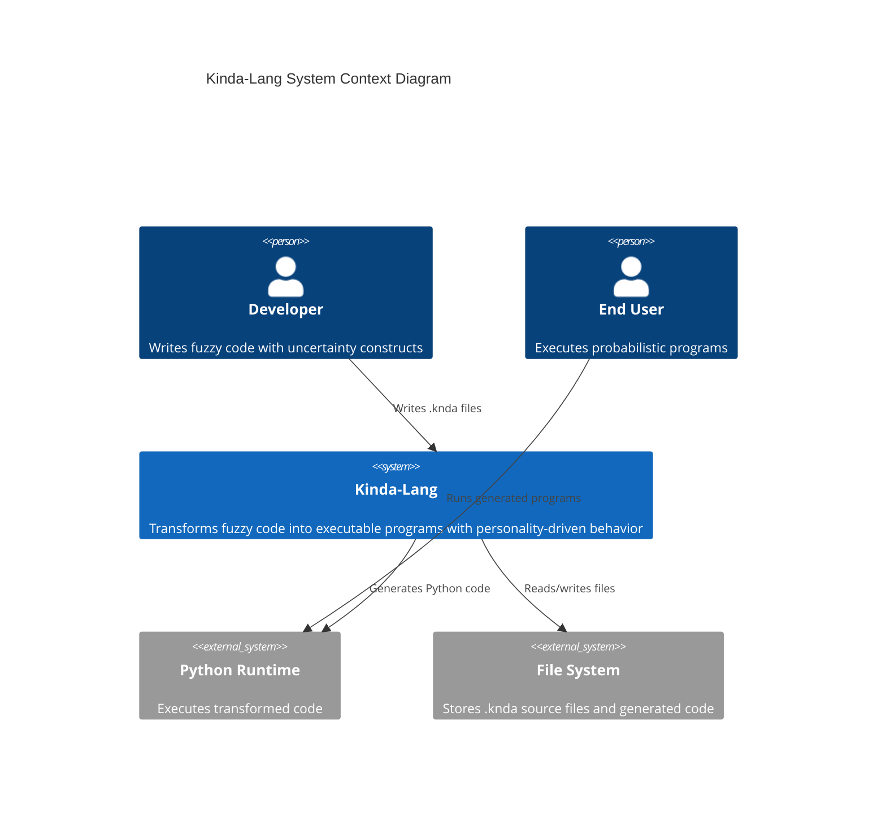
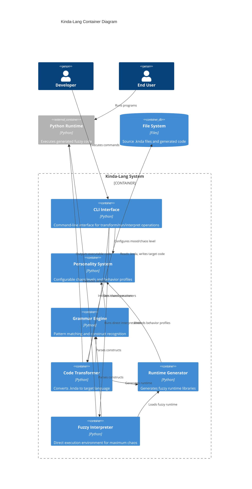

# Kinda-Lang C4 System/Container Diagram

## System Context

Kinda-Lang is a fuzzy programming language that transforms uncertainty into executable code through probabilistic constructs and personality-driven behavior.

## Container Diagram

## Key Components & Source References

### CLI Interface (`kinda/cli.py:250-483`)
- **Entry Point**: `main()` function handles argument parsing
- **Commands**: transform, run, interpret, examples, syntax
- **File Validation**: `validate_knda_file()` and `safe_read_file()`
- **Error Handling**: Graceful failures with helpful error messages

### Personality System (`kinda/personality.py:111-272`)
- **Profiles**: reliable, cautious, playful, chaotic mood configurations
- **Chaos Control**: `PersonalityContext` singleton manages global behavior
- **Parameter Adjustment**: Dynamic probability and variance modulation
- **State Tracking**: Execution count and instability tracking

### Grammar Engine (`kinda/grammar/python/`)
- **Constructs**: `constructs.py:5-338` defines all fuzzy language constructs
- **Matchers**: `matchers.py:150-172` provides pattern recognition
- **Parsing**: String-aware, balanced parentheses parsing

### Code Transformer (`kinda/langs/python/transformer.py`)
- **Main Transform**: `transform_file()` converts .knda to Python
- **Line Processing**: `transform_line()` handles individual constructs
- **Block Processing**: Conditional block handling with nesting support
- **Inline Constructs**: `~ish` and `~welp` inline transformations

### Runtime Generator (`kinda/langs/python/runtime_gen.py`)
- **Dynamic Generation**: `generate_runtime_helpers()` creates needed functions
- **Core Runtime**: `generate_runtime()` builds fuzzy.py with all constructs
- **Lazy Loading**: Only generates helpers for used constructs

### Fuzzy Interpreter (`kinda/interpreter/repl.py:28-56`)
- **Direct Execution**: Bypasses file generation for immediate chaos
- **Runtime Loading**: Dynamic module loading and execution
- **Error Handling**: Graceful failure with personality-appropriate messages

## Architecture Characteristics

### Modularity
- Clear separation between parsing, transformation, and runtime generation
- Pluggable personality system affects all components
- Language-agnostic design (Python implementation, C planned)

### Extensibility
- New constructs added through grammar definitions
- Personality profiles easily configurable
- Runtime generation supports dynamic helper inclusion

### Reliability
- Comprehensive error handling with context-aware messages
- File encoding detection and safe reading
- Graceful degradation for parsing failures

### Performance
- Compiled regex patterns for construct matching
- Lazy runtime generation (only used helpers)
- Single-pass transformation with minimal overhead