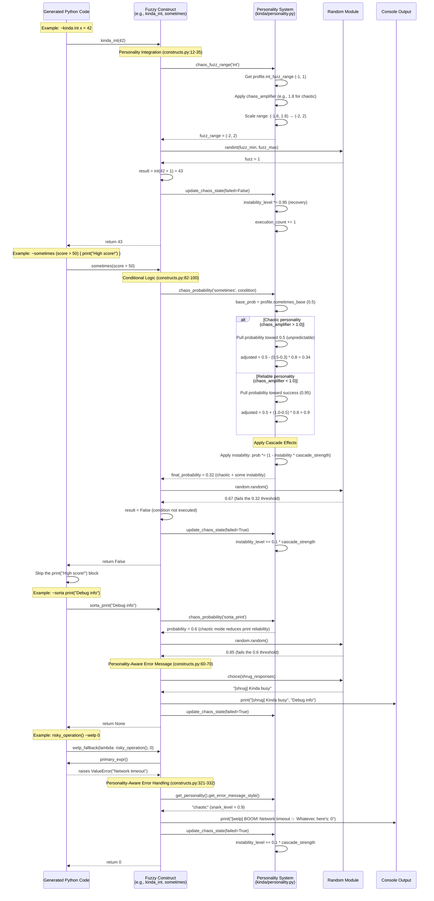
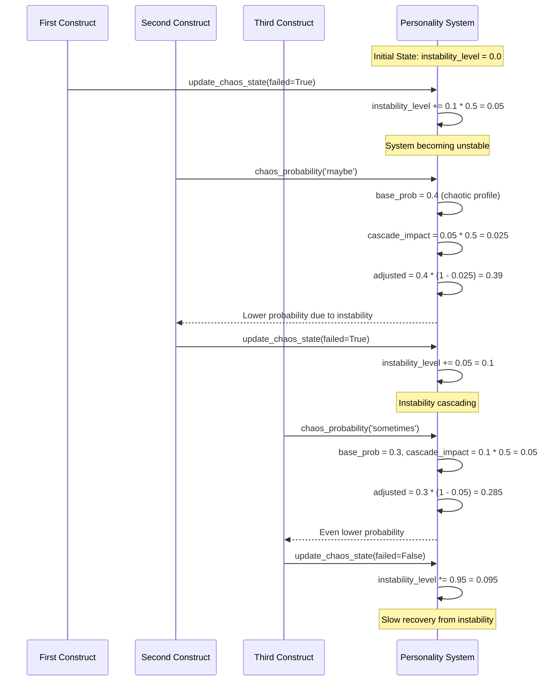

# Kinda-Lang Construct Execution Flow

## Fuzzy Construct Execution Sequence

This diagram shows how fuzzy constructs interact with the personality system during runtime execution.

## State Tracking and Cascade Effects

## Key Runtime Characteristics

### Personality-Driven Behavior
- **Dynamic Adjustment**: Each construct queries personality for current parameters
- **Consistent Philosophy**: All constructs share the same chaos level and error style
- **Cascade Effects**: Failed operations increase system instability, affecting subsequent operations

### State Tracking
- **Execution Count**: Tracks total operations for time-based effects
- **Instability Level**: Accumulates from failures, slowly recovers from successes
- **Chaos Amplification**: Global multiplier affects all randomness and variance

### Error Handling Hierarchy
1. **Professional** (reliable): "Expression returned None, using fallback"
2. **Friendly** (cautious): "Got nothing there, trying fallback"  
3. **Snarky** (playful): "Well that was useless, falling back to"
4. **Chaotic** (chaotic): "BOOM! Network timeout 💥 Whatever, here's"

This design creates emergent complexity where individual construct failures affect overall system behavior, simulating realistic software degradation patterns.