# Kinda-Lang Transformation Flow Sequence Diagrams

## 1. Transform Command Flow

This diagram shows the complete flow from CLI command to generated Python code.

## 2. Interpret Command Flow (Maximum Chaos Mode)

This diagram shows the direct interpretation flow that bypasses file generation.

```mermaid
sequenceDiagram
    participant User
    participant CLI as CLI Interface<br/>(kinda/cli.py:438-472)
    participant Personality as Personality System
    participant Interpreter as Fuzzy Interpreter<br/>(kinda/interpreter/repl.py:28-56)
    participant Transformer as Code Transformer
    participant RuntimeGen as Runtime Generator
    participant PythonRuntime as Python Runtime
    participant FileSystem as File System

    User->>CLI: kinda interpret chaos.py.knda --mood chaotic
    
    Note over CLI: Setup and Validation (438-458)
    CLI->>CLI: validate_knda_file(input_path)
    CLI->>Personality: setup_personality("chaotic")
    Personality->>Personality: Set chaos_amplifier=1.8, error_snark_level=0.9
    
    Note over CLI: Invoke Interpreter (465-469)
    CLI->>Interpreter: run_interpreter(filepath, "python")
    
    Note over Interpreter: Transform Code (32-33)
    Interpreter->>Transformer: transform_file(input_path)
    Transformer->>FileSystem: Read and parse .knda file
    Transformer->>RuntimeGen: Track used helpers during transformation
    Transformer-->>Interpreter: Transformed Python code string
    
    Note over Interpreter: Prepare Runtime (35-42)
    Interpreter->>RuntimeGen: generate_runtime(runtime_path)
    RuntimeGen->>FileSystem: Create temporary fuzzy.py
    Interpreter->>RuntimeGen: generate_runtime_helpers(used_helpers)
    RuntimeGen-->>Interpreter: Helper import code
    
    Note over Interpreter: Load Fuzzy Runtime (44-50)
    Interpreter->>Interpreter: load_fuzzy_runtime(fuzzy.py)
    Interpreter->>PythonRuntime: Import fuzzy module dynamically
    PythonRuntime-->>Interpreter: Fuzzy runtime module with env dict
    
    Note over Interpreter: Execute Code (52-56)
    Interpreter->>PythonRuntime: exec(helper_imports, fuzzy.env)
    Interpreter->>PythonRuntime: exec(transformed_code, fuzzy.env)
    
    Note over PythonRuntime: During Execution
    loop Each fuzzy construct call
        PythonRuntime->>Personality: chaos_probability("sometimes")
        Personality->>Personality: Apply chaotic amplifier (1.8x chaos)
        Personality-->>PythonRuntime: Adjusted probability (more unpredictable)
        PythonRuntime->>PythonRuntime: Execute with chaos parameters
        PythonRuntime->>Personality: update_chaos_state(failed=result)
    end
    
    alt Execution succeeds
        PythonRuntime-->>Interpreter: Program output with chaos effects
        Interpreter-->>CLI: Execution complete
        CLI-->>User: "Chaos complete. Reality may have shifted slightly."
    else Execution fails
        PythonRuntime-->>Interpreter: Exception with snarky error message
        CLI-->>User: "💥 Well, that went sideways: {error}"
    end
```

## Key Sequence Characteristics

### Transform Flow
- **File-Based**: Generates permanent Python files for later execution
- **Two-Phase**: Transform first, then generate minimal runtime
- **Tracked Dependencies**: Only includes runtime helpers that are actually used
- **Error Context**: Line-by-line error reporting with file context

### Interpret Flow  
- **Memory-Based**: No intermediate files, direct execution
- **Real-Time Chaos**: Personality system affects execution immediately
- **Dynamic Loading**: Runtime generated and loaded on-demand
- **Maximum Chaos**: Designed for exploration and testing edge cases

### Personality Integration Points
Both flows integrate with the personality system at key moments:
1. **Setup**: Mood configuration affects all subsequent operations
2. **Runtime Generation**: Personality parameters embedded in generated code
3. **Execution**: Real-time chaos adjustment during construct evaluation
4. **Error Handling**: Error message style matches personality profile